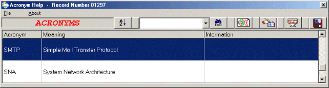



## Acronym App using MsFlexGrid

### Description

This project is a complete application with a data file of over 1500 computer related Acronyms and their meanings. Functionality includes - Add new entries, Edit existing entries, Deleting, Saving, Sorting and Searching.
 
### More Info
 
The MsFlexGrid is a great control for displaying information in a neat and attractive manner and certainly complements data when it needs to be displayed in a similar fashion to that of database and spreadsheet design. You can modify this project to suit your own purpose and even add further functionality.

The MsFlexGrid isn't as straight forward as most of the VB controls and there are a few Idiosyncrasies to take into account. How the control manages it's internal array is dubious to say the least and losing track of the array position of an item can be problematic in it's cause. Therefore you should pay special attention to any Sort, Add, Edit and Delete procedures.

             |
---                |---
**Submitted On**   |2002-05-11 14:12:20
**By**             |[Kev Heywood](https://github.com/Planet-Source-Code/PSCIndex/blob/master/ByAuthor/kev-heywood.md)
**Level**          |Advanced
**User Rating**    |4.6 (41 globes from 9 users)
**Compatibility**  |VB 5\.0, VB 6\.0
**Category**       |[Complete Applications](https://github.com/Planet-Source-Code/PSCIndex/blob/master/ByCategory/complete-applications__1-27.md)
**World**          |[Visual Basic](https://github.com/Planet-Source-Code/PSCIndex/blob/master/ByWorld/visual-basic.md)
**Archive File**   |[Acronym\_Ap819575112002\.zip](https://github.com/Planet-Source-Code/kev-heywood-acronym-app-using-msflexgrid__1-34678/archive/master.zip)

